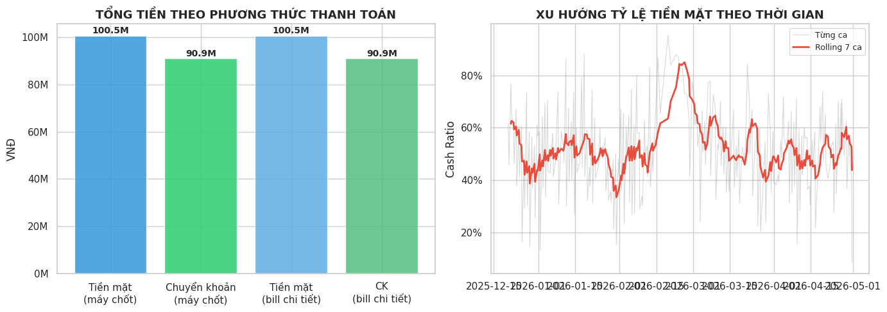
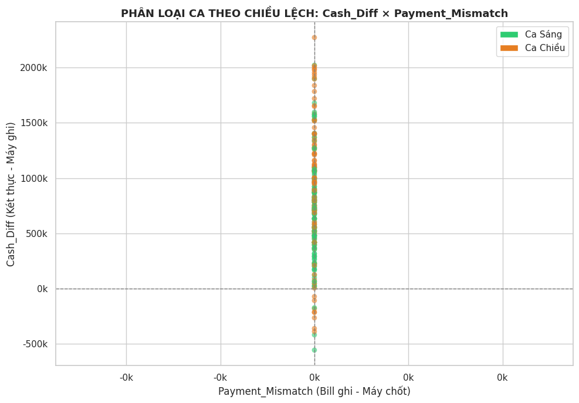

# 📄 BÁO CÁO KỸ THUẬT: ĐỐI SOÁT DOANH THU THEO CA (PHASE 1 - DESCRIPTIVE)

Tài liệu này giải thích chi tiết cấu trúc toán học và ý nghĩa của từng biểu đồ trong quy trình Phân tích Dữ liệu Khám phá (Exploratory Data Analysis - EDA) nhằm đối soát doanh thu. Các biểu đồ này được trích xuất trực tiếp từ mã nguồn phân tích dữ liệu.

---

#### 1. Biểu đồ Phân phối Lệch Két và Lệch Đối soát Bill (Histogram & KDE)

**Mục đích:** Đánh giá mức độ sai lệch tài chính của các ca làm việc.

**Cấu trúc biểu đồ:** Biểu đồ này là sự kết hợp của hai dạng trực quan hóa dữ liệu thống kê:

- **Histogram (Biểu đồ tần suất - Các cột màu):** Trục hoành (trục X) biểu diễn các khoảng giá trị sai lệch tiền tệ (VNĐ), trục tung (trục Y) biểu diễn số lượng ca làm việc rơi vào khoảng đó.

    
- **KDE - Kernel Density Estimate (Đường cong liền mạch):** Phương pháp ước lượng mật độ hạt nhân, giúp làm mịn các cột tần suất để vẽ ra một đường cong phân phối xác suất liên tục.
    
- **Các đường đánh dấu:**
    
    - Đường nét đứt màu đen (Tọa độ 0): Đại diện cho mức khớp hoàn toàn (không có sai lệch).
        
    - Đường nét đứt màu cam: Biểu diễn giá trị trung bình (Mean) của độ lệch.
        

**Diễn giải dữ liệu (Insights):**

- **Biểu đồ bên trái (Cash_Diff - Lệch két):** Phân phối dữ liệu trải rộng và lệch hẳn sang phải (Positive Skewness). Hầu hết các ca đều có tình trạng dư két (giá trị dương). Giá trị trung bình là 771.148 VNĐ. Để biểu đồ dễ đọc hơn, trục X đã được giới hạn (clip) từ -500k đến 1.500k VNĐ nhằm loại bỏ các giá trị dị biệt (outliers).
    
    +1
    
- **Biểu đồ bên phải (Payment_Mismatch - Lệch đối soát bill):** Một cột tần suất duy nhất tại điểm 0 VNĐ. Điều này chứng tỏ toàn bộ dữ liệu ghi nhận trên hệ thống khớp 100% với chi tiết từng hóa đơn, không có ca nào bị lệch doanh thu.
    

---

#### 2. Biểu đồ Hộp: So sánh Ca Sáng và Ca Chiều (Boxplot)

**Mục đích:** So sánh trực quan sự khác biệt về các chỉ số tài chính giữa hai nhóm: Ca Sáng và Ca Chiều.

**Cấu trúc biểu đồ:** Biểu đồ hộp (Boxplot) cung cấp tóm tắt thống kê 5 số (Five-number summary):

- **Đường kẻ ngang bên trong hộp:** Biểu thị giá trị Trung vị (Median), tức là giá trị đứng ở giữa tập dữ liệu khi đã được sắp xếp.
    
- **Khối hộp (Box):** Đại diện cho Khoảng Tứ phân vị (Interquartile Range - IQR), bao chứa 50% lượng dữ liệu tập trung ở vùng trung tâm (giữa Tứ phân vị thứ nhất Q1 và Tứ phân vị thứ ba Q3).
    
- **Râu (Whiskers):** Hai đoạn thẳng kéo dài từ khối hộp biểu thị sự phân tán của dữ liệu.
    
- _Lưu ý:_ Các điểm dị biệt (Outliers) nằm ngoài râu đã được hệ thống chủ động ẩn đi (bằng lệnh `showfliers=False`) để biểu đồ không bị biến dạng và dễ dàng tập trung vào cấu trúc cốt lõi.
    

**Diễn giải dữ liệu (Insights):**

- **Biểu đồ Lệch Két (Trái):** Ca Chiều có mức độ hụt/dư két trung vị cao hơn và độ phân tán lớn hơn so với Ca Sáng.
    
- **Biểu đồ Lệch Đối soát (Giữa):** Cả hai ca đều nằm trên một đường thẳng tuyệt đối tại mốc 0, tái khẳng định rằng không có bất kỳ sai lệch nào giữa tổng doanh thu máy chốt và chi tiết hóa đơn.
    
- **Biểu đồ Doanh thu (Phải):** Ca Sáng có mức doanh thu trung vị cao hơn hẳn so với Ca Chiều.
    

---

#### 3. Biểu đồ Chuỗi Thời gian (Time Series Plot)

**Mục đích:** Phân tích xu hướng biến động của sai lệch tài chính và doanh thu theo trình tự thời gian.

**Cấu trúc biểu đồ:** Gồm hai biểu đồ con (sub-plots) đồng bộ theo trục thời gian (trục X):

- **Biểu đồ trên (Line Plot - Đường gấp khúc):**
    
    - Trục Y là Số tiền lệch (VNĐ).
        
    - Đường màu đỏ có các điểm (markers) đại diện cho mức "Lệch Két (Cash_Diff)" của từng ca làm việc liên tiếp nhau.
        
    - Đường màu xanh nhạt nằm ngang sát trục 0 đại diện cho "Lệch Bill (Payment_Mismatch)".
        
    - Đường gạch ngang đứt nét màu đen là mức Baseline (Khớp hoàn toàn). Vùng được tô màu đỏ nhạt (dưới mức Baseline) nhằm nhấn mạnh các ca làm việc bị hụt két (âm tiền).
        
        +1
        
- **Biểu đồ dưới (Bar Chart - Biểu đồ cột):**
    
    - Trục Y là Doanh thu (VNĐ).
        
    - Mỗi cột đại diện cho doanh thu của một ca trực, được phân biệt bằng màu sắc: Xanh ngọc (Ca Sáng) và Cam (Ca Chiều).
        

**Diễn giải dữ liệu (Insights):**

- Lệch két (đường đỏ) biến động liên tục và mạnh mẽ qua từng ngày, chủ yếu nằm ở vùng giá trị dương (dư két).
    
- Tương tự các phân tích trước, đường Lệch Bill (màu xanh) luôn ổn định ở mức 0.
    
- Biểu đồ doanh thu phía dưới cho thấy chu kỳ doanh thu xen kẽ giữa Ca Sáng và Ca Chiều.
    

---

#### 4. Biểu đồ Ma trận Tương quan (Correlation Heatmap)

**Mục đích:** Đo lường và trực quan hóa mức độ tương quan tuyến tính giữa các biến số tài chính.

**Cấu trúc biểu đồ:**

- Sử dụng hình thức "Biểu đồ Nhiệt Tam giác dưới" (Lower-triangle Heatmap) để tránh lặp lại dữ liệu dư thừa ở nửa trên.
    
- Các con số trong ô biểu diễn **Hệ số Tương quan Pearson (Pearson Correlation Coefficient)**, chạy từ -1.0 đến +1.0.
    
- Thang màu (Color bar) bên phải đóng vai trò giải nghĩa: Màu đỏ sậm thể hiện tương quan dương mạnh, màu xanh dương sậm thể hiện tương quan âm mạnh, và màu nhạt (gần trắng) thể hiện ít hoặc không có tương quan.
    

**Diễn giải dữ liệu (Insights):**

- **Tương quan mạnh nhất:** "Cash_Diff" (Lệch két) có hệ số tương quan gần như tuyệt đối (0.91) với "actual_cash_in_drawer" (Tiền mặt thực tế trong két). Điều này chỉ ra rằng lượng tiền trong két càng lớn, mức độ lệch két (dư tiền) ghi nhận được càng cao.
    
- **Tương quan nhóm Doanh thu:** "bill_count" (Số lượng hóa đơn) có tương quan dương mạnh với "total_revenue" (0.90) và "cash_amount" (0.80), cho thấy doanh thu và lượng tiền mặt tăng đồng biến với số lượng hóa đơn phát sinh.
    
- Các chỉ số "Payment_Mismatch" và "Revenue_Mismatch" hoàn toàn trắng do chúng có giá trị bằng 0 ở mọi điểm dữ liệu.
    

---

#### 5. Biểu đồ Phân tích Phương thức Thanh toán và Tỷ lệ Tiền mặt

**Mục đích:** Khảo sát cơ cấu phương thức thanh toán và sự biến thiên của tỷ lệ tiền mặt qua thời gian.

**Cấu trúc biểu đồ:**

- **Biểu đồ cột (Trái): Tổng tiền theo phương thức thanh toán.**
    
    - So sánh tổng giá trị Tiền mặt và Chuyển khoản (CK) dựa trên hai nguồn dữ liệu: Hệ thống máy chốt sổ và Chi tiết từng hóa đơn.
        
    - Các cột màu Xanh dương đại diện cho Tiền mặt, cột màu Xanh lá đại diện cho Chuyển khoản.
        
- **Biểu đồ đường (Phải): Xu hướng Tỷ lệ Tiền mặt theo thời gian.**
    
    - Đường mờ màu xám biểu diễn Tỷ lệ tiền mặt (Cash Ratio) của từng ca trực đơn lẻ.
        
    - Đường nét đậm màu đỏ áp dụng kỹ thuật **Đường trung bình động 7 ca (Rolling 7-shift Mean)**. Kỹ thuật này giúp khử nhiễu (noise) và làm mượt dữ liệu, cho phép nhìn rõ xu hướng bao quát trong ngắn hạn thay vì các biến động chắp vá.
        

**Diễn giải dữ liệu (Insights):**

- Biểu đồ bên trái xác nhận tính toàn vẹn của dữ liệu: Tổng số tiền mặt (100.5 Triệu) và Chuyển khoản (90.9 Triệu) hoàn toàn khớp nhau giữa Máy chốt sổ và Chi tiết hóa đơn.
    
- Biểu đồ bên phải cho thấy tỷ lệ thanh toán bằng tiền mặt dao động liên tục nhưng có xu hướng giữ ở mức xấp xỉ 40% - 60% trên cơ sở trung bình động.
    

---

#### 6. Biểu đồ Phân tán (Scatter Plot): Phân loại Ca theo Chiều lệch

**Mục đích:** Phân loại và nhận diện các ca làm việc dựa trên mối quan hệ giữa hai chiều sai lệch: Lệch Két và Lệch Đối soát Bill.

**Cấu trúc biểu đồ:**

- **Scatter Plot (Biểu đồ phân tán):** Mỗi dấu chấm tròn biểu thị một ca làm việc cụ thể.
    
- Hệ tọa độ:
    
    - Trục Y biểu diễn độ Lệch Két (Cash_Diff).
        
    - Trục X biểu diễn độ Lệch Đối soát Bill (Payment_Mismatch).
        
- Màu sắc: Dấu chấm màu Xanh lục là Ca Sáng, màu Cam là Ca Chiều.
    
- Hai đường nét đứt giao nhau tại gốc tọa độ (0,0) chia không gian thành 4 góc phần tư, giúp định vị loại rủi ro của từng ca.
    

**Diễn giải dữ liệu (Insights):**

- Toàn bộ dữ liệu nằm chồng chéo lên nhau tạo thành một cột thẳng đứng duy nhất ngay tại tọa độ X = 0. Điều này một lần nữa khẳng định độ Lệch Đối soát Bill là 0 đối với tất cả các ca.
    
- Các dấu chấm phân bố dọc theo trục Y (Lệch két) cho thấy sự đa dạng trong việc dư hoặc hụt két, trong đó Ca Chiều (màu cam) có xu hướng tập trung ở các mức lệch dương cao hơn so với Ca Sáng (màu xanh).