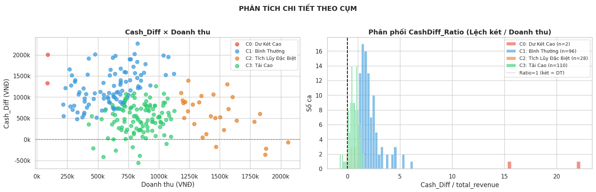
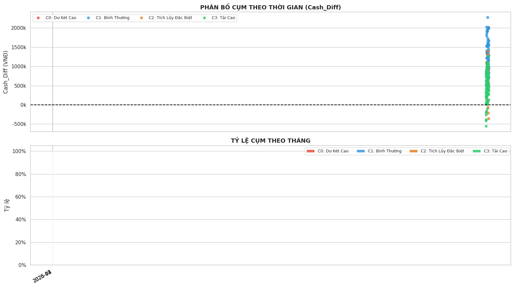
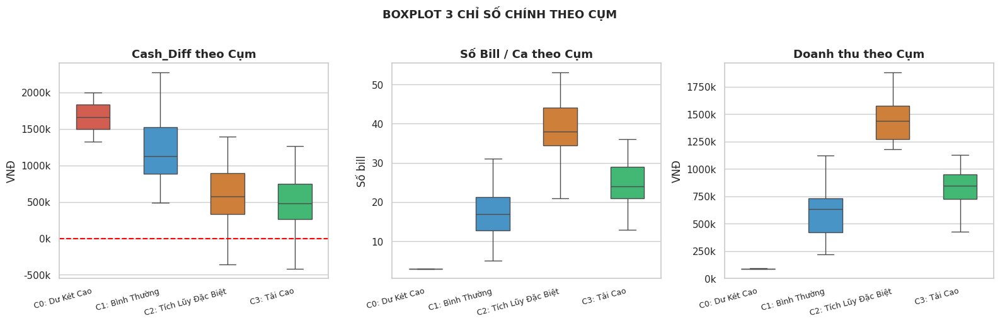

# 📄 BÁO CÁO GIẢI THÍCH VÒNG 2: DIAGNOSTIC (PHÂN CỤM K-MEANS)

Mục tiêu của Vòng 2 là tự động phân nhóm (Clustering) các ca làm việc dựa trên mức độ sai lệch tiền tệ và đặc điểm vận hành. Thuật toán **K-Means** được sử dụng để tìm ra các "kịch bản" (patterns) dẫn đến việc lệch két, từ đó giúp kiểm toán viên biết cần tập trung vào nhóm ca nào.

---

## I. KỸ THUẬT FEATURE ENGINEERING & CHUẨN HÓA (SCALING)

Trước khi đưa vào mô hình, dữ liệu thô được bổ sung thêm các đặc trưng (Features) quan trọng nhằm phản ánh đúng bản chất nghiệp vụ:

1. **`CashDiff_Ratio` (Tỷ lệ Lệch két / Doanh thu):** Hụt 100k ở ca bán được 500k sẽ nghiêm trọng hơn hụt 100k ở ca bán được 10 triệu. Biến này giúp chuẩn hóa mức độ sai lệch theo quy mô ca.
    
2. **`Avg_Bill_Value` (Giá trị đơn TB):** Phản ánh hành vi khách hàng (đơn lẻ nhỏ vs đơn sỉ/nhóm lớn).
    
3. **`Drawer_vs_Revenue` (Tỷ lệ Két / Doanh thu):** Biến cốt lõi để phát hiện **"Tích lũy két"**. Nếu tỷ lệ này lớn hơn 1.5 - 2.0x, nghĩa là tiền trong két là cộng dồn từ các ca trước do nhân viên không bàn giao/rút tiền, gây rủi ro thất thoát.
    
4. **Sử dụng `RobustScaler`:** Thay vì chuẩn hóa trung bình (`StandardScaler`), mô hình dùng `RobustScaler` (dựa trên Trung vị và khoảng IQR) để không bị "bóp méo" bởi các ca lệch tiền cực kỳ lớn (outliers).
    

> **💡 Insight quan trọng nhất từ Data gốc:** Toàn bộ dữ liệu ghi nhận `Payment_Mismatch = 0`. Điều này chứng tỏ **không có lỗi bấm nhầm hình thức thanh toán (Tiền mặt/Chuyển khoản) trên máy POS**. Mọi sai lệch hiện tại thuần túy nằm ở thao tác quản lý tiền mặt vật lý (`Cash_Diff`).

---

## II. GIẢI THÍCH CHI TIẾT 9 BIỂU ĐỒ (MAPPING THEO TRÌNH TỰ)

Dưới đây là giải thích chi tiết cho từng hình ảnh được sinh ra trong quá trình chạy mô hình, theo đúng trình tự phân tích.

### Hình 1: LỰA CHỌN SỐ CỤM TỐI ƯU (Elbow Curve & Silhouette Score)

- **Mục đích:** Tìm ra số lượng nhóm (k) phù hợp nhất để chia dữ liệu.
    

    
- **Giải thích:**
    
    - **Elbow Curve (Trái):** Thể hiện tổng bình phương khoảng cách từ các điểm đến tâm cụm (Inertia). Đường cong gãy gập rõ ràng (tạo thành "khuỷu tay") tại **`k=4`**. Từ `k=5` trở đi, việc thêm cụm không làm mô hình tốt hơn đáng kể.
        
    - **Silhouette Score (Phải):** Đánh giá chất lượng của cụm. Cột màu đỏ tại `k=4` cho điểm `0.271`, là mức độ phân tách tối ưu nhất, đảm bảo mô hình không bị chia quá vụn vặt và vẫn giữ được ý nghĩa nghiệp vụ.
        

### Hình 2: SILHOUETTE ANALYSIS (Chất lượng phân cụm từng ca)

- **Mục đích:** Đánh giá độ tin cậy của từng điểm dữ liệu bên trong cụm của nó.

    
- **Giải thích:** Biểu đồ dải băng này hiển thị hệ số Silhouette cho _từng ca làm việc_. Đường đứt nét màu đỏ là điểm trung bình (0.271). Mặc dù dữ liệu tài chính thực tế có độ nhiễu cao, nhưng dải băng của cả 4 cụm (C0, C1, C2, C3) đều vượt qua vạch đỏ trung bình. Điều này xác nhận việc chia 4 cụm là hoàn toàn hợp lệ về mặt toán học.
    

### Hình 3: RADAR CHART (Đặc trưng từng cụm - Chuẩn hóa 0-1)

- **Mục đích:** Lập "Hồ sơ nhận diện" (Profile) cho 4 cụm thông qua việc so sánh đồng thời 5 chỉ số quan trọng.

    
- **Giải thích & Gán nhãn nghiệp vụ:**
    
    - 🔴 **C0 (Dư Két Cao - 0.8%):** Đỉnh đâm thẳng ra ngoài ở `Lệch/DT (Ratio)` và `Lệch Két`. Đây là các ca dị biệt: Doanh thu cực thấp (vài chục nghìn) nhưng két báo dư hàng triệu đồng.
        
    - 🔵 **C1 (Bình Thường - 40.7%):** Đa giác co cụm ở giữa. Mọi chỉ số đều thấp/trung bình. Không có rủi ro.
        
    - 🟠 **C2 (Tích Lũy Đặc Biệt - 11.9%):** Kéo dài về phía `Doanh thu` và `Số bill`. Đây là nhóm **Rủi ro cao nhất**, tiền két cộng dồn khổng lồ, áp lực vận hành lớn, chứa nhiều ca hụt két nghiêm trọng.
        
    - 🟢 **C3 (Tải Cao - 46.6%):** Nhóm vận hành bận rộn. `Số bill` và `Doanh thu` ở mức khá cao, có rủi ro hụt két do thối nhầm tiền lúc đông khách.
        

### Hình 4: PHÂN BỐ CỤM TRONG KHÔNG GIAN FEATURE (PCA 2D & Scatter)

- **Mục đích:** Xem xét ranh giới giữa các cụm.
    

- **Giải thích:**
    
    - **PCA 2D (Trái):** Nén 6 chiều dữ liệu xuống 2 chiều (PC1 & PC2) giữ được 76.6% thông tin. Các dấu `X` đen là tâm cụm. Sự phân tách rất rõ ràng, đặc biệt cụm C0 (đỏ) nằm hoàn toàn cô lập với phần còn lại.
        
    - **Scatter (Phải):** Tốc độ phục vụ (Số bill) vs Lệch két. Cụm C1 (Xanh dương) tập trung ở vùng ít bill. Cụm C3 (Xanh lá) và C2 (Cam) nằm ở vùng bill cao, và ta thấy rõ các điểm của C2, C3 tràn xuống khu vực `< 0k` (hụt két).
        

### Hình 5: PHÂN TÍCH CHI TIẾT THEO CỤM (Scatter & Phân phối Ratio)

- **Mục đích:** Xoáy sâu vào mối quan hệ giữa Doanh thu và Sai lệch.
    

- **Giải thích:**
    
    - **Scatter (Trái):** Cash_Diff vs Doanh thu. Ranh giới giữa cụm C1 (Xanh dương) và C3 (Xanh lá) được cắt dọc rõ rệt ở mức doanh thu ~600k. Cụm C2 (Cam) phân bổ dải rác ở vùng doanh thu > 1.2 triệu.
        
    - **Histogram (Phải):** Biểu đồ tần suất của tỷ lệ `Lệch / Doanh thu`. Cho thấy cụm C0 (Đỏ) dị thường đến mức tỷ lệ này lên tới 15x - 20x, trong khi các cụm khác chỉ bám sát trục số 0 - 2.
        

### Hình 6: PHÂN BỐ CỤM THEO THỜI GIAN

- **Mục đích:** Kiểm tra xem các cụm có tính chu kỳ hay xuất hiện dồn dập vào một khoảng thời gian nào không.

    
- **Giải thích:** Trục X là dòng thời gian (Tháng 12/2025 - Tháng 4/2026). Dữ liệu rải đều, cho thấy hiện tượng lệch két (đặc biệt là các chấm cam C2 và chấm xanh lá C3 rớt xuống dưới đường 0) diễn ra rải rác và liên tục trong suốt quá trình hoạt động, không phải do một sự cố hệ thống cục bộ của một ngày cụ thể.
    

### Hình 7: TỶ LỆ CA SÁNG / CA CHIỀU TRONG TỪNG CỤM

- **Mục đích:** Liên kết hành vi lệch két với yếu tố nhân sự / ca làm việc.
    

- **Giải thích:**
    
    - Cụm dị biệt C0 (Dư két) 100% xảy ra vào Ca Chiều.
        
    - Cụm C1 (Bình thường) chiếm đa số ở Ca Chiều (~75%).
        
    - Ngược lại, các cụm rủi ro cao là C2 (Tích lũy) và C3 (Tải cao) lại có tỷ lệ **Ca Sáng** áp đảo (>60%). Điều này cho thấy Ca Sáng bận rộn hơn và nhân viên Ca Sáng thường để lại két cho Ca Chiều mà không chốt tiền.
        

### Hình 8: HEATMAP CENTROIDS (Đặc trưng tâm cụm)

- **Mục đích:** Hiển thị con số toán học đằng sau Radar Chart.

    
- **Giải thích:** Bảng màu ma trận cho thấy giá trị chuẩn hóa của các Tâm cụm (Centroids). Cụm C0 có `CashDiff_Ratio` cao chót vót (13.95). Cụm C2 có `total_revenue` (2.11) và `bill_count` (1.56) nóng nhất (màu vàng nhạt/xanh), minh chứng bằng số liệu cho nhận định C2 là nhóm "Tải siêu cao".
    

### Hình 9: BOXPLOT 3 CHỈ SỐ CHÍNH THEO CỤM

- **Mục đích:** Cung cấp góc nhìn thống kê cực kỳ chi tiết (Giá trị Min, Max, Trung vị, Phân vị 25-75).
    

- **Giải thích:**
    
    - **Cash_Diff:** Cụm C2 và C3 có phần "râu" (whisker) đâm thẳng xuống dưới đường đứt nét màu đỏ (mức 0 VNĐ), khẳng định đây là 2 nhóm gây ra tình trạng mất tiền (hụt két).
        
    - **Số bill & Doanh thu:** Cụm C2 (Cam) có hộp (box) nằm ở vị trí cao nhất, cách biệt hoàn toàn so với C1 (Xanh dương). Trung vị doanh thu của C2 lên tới gần 1.5 triệu, số bill trung bình gần 40. Đây chính là "vùng tử địa" cần được cài đặt Rule giám sát trong các vòng tiếp theo.