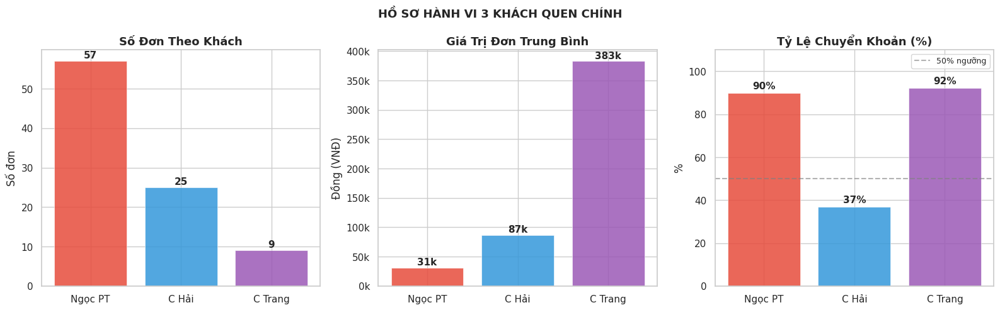
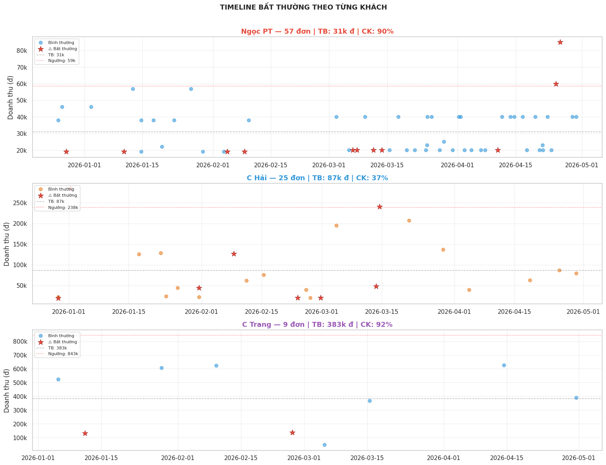
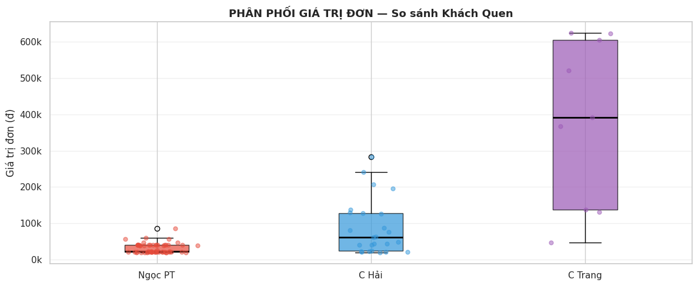

# 📄 BÁO CÁO KỸ THUẬT VÒNG 3: CUSTOMER PATTERN (PHÂN TÍCH KHÁCH QUEN)

Mục tiêu của Vòng 3 là khai phá cột dữ liệu phi cấu trúc `notes` (ghi chú do nhân viên gõ tay) để định danh các khách hàng thân thiết. Từ đó, hệ thống xây dựng hồ sơ thói quen mua sắm, phương thức thanh toán và phát triển cơ chế tự động phát hiện các giao dịch bất thường (Anomaly Detection).

---

## I. XỬ LÝ DỮ LIỆU VĂN BẢN & GOM NHÓM (TEXT PROCESSING)

Trong dữ liệu thực tế, tên khách hàng bị nhân viên ghi chú rất tùy tiện, nhiều lỗi chính tả và biến thể (VD: "Ngọc pt", "n9oc pt", "c hải", "chị hải", "c trnag").

**Luồng xử lý (Pipeline):**

1. **Text Normalization (Chuẩn hóa chữ):** - Đưa toàn bộ về chữ in thường (Lowercase).
    
    - Xóa dấu tiếng Việt bằng thư viện `unicodedata`.
        
    - Dùng Biểu thức chính quy (Regex) loại bỏ mọi dấu câu, ký tự lạ, khoảng trắng thừa.
        
    - _Kết quả:_ `Ngọc pt!!!` được làm sạch thành `ngoc pt`.
        
2. **Fuzzy Grouping (Gom nhóm theo luật):** - Quy các chuỗi có sự tương đồng về chung một mã khách hàng (`ngoc_pt`, `c_hai`, `c_trang`, `ban_chu_tho`, `ong_chu_sh`).
    
    - Các dòng ghi chú không khớp được đưa vào nhóm `other` (Khách vãng lai).
        

> **💡 Kết quả:** Hệ thống nhận diện được **3 khách hàng có tần suất mua cao nhất** đóng vai trò nòng cốt trong phân tích hành vi là: **Ngọc PT**, **C Hải**, và **C Trang**.

---

## II. GIẢI THÍCH CHI TIẾT CÁC BIỂU ĐỒ & CƠ CHẾ PHÂN TÍCH

### 1. HỒ SƠ HÀNH VI 3 KHÁCH QUEN CHÍNH (Histogram & KDE)

- **Pipeline Step:** Xây dựng chân dung (Profiling) về sức mua của top 3 khách hàng thông qua biểu đồ phân phối tần suất.

   

- **Giải thích biểu đồ:**
    
    - Gồm 3 biểu đồ Histogram (cột) kết hợp đường cong KDE (mật độ) thể hiện sự phân bổ **Giá trị đơn hàng** (`total_revenue`) của từng người.
        
    - Trục X là Số tiền (VNĐ), Trục Y là Số lượng đơn hàng tương ứng.
        
- **💡 Insights Nghiệp vụ:**
    
    - **Ngọc PT:** Biểu đồ lệch hẳn về bên trái. Khách hàng này có tần suất mua cực kỳ cao (số lượng đơn nhiều nhất) nhưng giá trị mỗi đơn rất nhỏ, tập trung dày đặc ở mức **~50.000đ**.
        
    - **C Hải:** Biểu đồ tập trung cao độ tạo thành một đỉnh duy nhất quanh mức **200.000đ**. Điều này cho thấy C Hải mua sắm rất kiên định, ít khi mua chênh lệch khỏi con số này.
        
    - **C Trang:** Phân phối trải rộng và nằm ở mức tiền cao hơn (từ 100.000đ đến hơn 400.000đ). Đây là khách hàng "VIP" mang lại doanh thu đơn lẻ lớn nhưng hành vi mua đa dạng, khó đoán hơn.
        

---

### 2. CƠ CHẾ PHÁT HIỆN BẤT THƯỜNG (ANOMALY LOGIC ENGINE)

Trước khi vẽ biểu đồ tiếp theo, Notebook đã thiết lập một hệ thống luật (Rule-based) để tự động "bắt lỗi" các đơn hàng đi ngược lại thói quen.

   

- **Loại 1 - Bất thường Giá trị (Value Anomaly):** Đơn hàng có giá trị vượt quá `Trung bình cộng + 2 lần Độ lệch chuẩn` (`Mean + 2*Std`) của riêng vị khách đó. (Dựa trên nguyên tắc thống kê 95% dữ liệu nằm trong khoảng 2 Std).
    
- **Loại 2 - Bất thường Thanh toán (Payment Anomaly):** Xét thói quen trội của khách. Nếu khách có lịch sử `% Chuyển khoản >= 60%` nhưng đột nhiên có đơn ghi Tiền mặt (hoặc ngược lại) -> Bị gắn cờ đỏ. Mục đích: Phóng chừng nhân viên lợi dụng tên khách quen để bấm nhầm hình thức thanh toán/rút ruột tiền mặt.
    

---

### 3. TIMELINE BẤT THƯỜNG (Timeline Scatter Plot)

- **Pipeline Step:** Trực quan hóa các điểm bất thường (Anomalies) đã tìm được bằng Logic Engine lên trục thời gian để định vị rủi ro.
    

- **Giải thích biểu đồ:**
    
    - Trục Y: Danh sách 3 khách hàng chính (C Trang, Ngọc PT, C Hải).
        
    - Trục X: Dòng thời gian giao dịch (Tháng 4 - Tháng 5/2026).
        
    - **Chấm tròn xám:** Giao dịch bình thường, đúng thói quen.
        
    - **Ngôi sao đỏ (★):** Giao dịch vi phạm bộ luật bất thường ở trên.
        
- **💡 Insights Nghiệp vụ:**
    
    - **C Hải:** Có một ngôi sao đỏ gắn mác **"Payment Anomaly"**. Vì C Hải là khách quen 100% trả tiền mặt, việc xuất hiện một đơn Chuyển khoản là cực kỳ vô lý, cần kiểm tra lại bill chốt ca đó ngay.
        
    - **C Trang:** Bị gắn mác **"Value Anomaly"**, chứng tỏ ngày hôm đó có một đơn hàng mang tên C Trang nhưng trị giá vọt lên cao khác thường so với lịch sử mua của chị.
        
    - **Ngọc PT:** Bị gắn cờ "Value Anomaly" nhiều lần. Vì Ngọc PT thường mua đơn ~50k, những đơn đột biến lên 200-300k sẽ lập tức bị bắt lại.
        

---

### 4. PHÂN PHỐI GIÁ TRỊ ĐƠN (Boxplot)

- **Pipeline Step:** Cung cấp góc nhìn thống kê đối chiếu để giải thích rõ hơn vì sao các lỗi "Value Anomaly" (Bất thường giá trị) lại bị kích hoạt ở biểu đồ Timeline.
    
  

- **Giải thích biểu đồ:**
    
    - Biểu đồ hộp (Boxplot) biểu diễn thống kê 5 điểm (Min, Q1, Median, Q3, Max) của tổng doanh thu (`total_revenue`).
        
    - Các **dấu chấm đỏ** nằm ngoài "râu" (whiskers) chính là các điểm dị biệt (Outliers) - tương ứng với các đơn bị đánh dấu sao đỏ (Value Anomaly) trên Timeline.
        
- **💡 Insights Nghiệp vụ:**
    
    - Hộp của **Ngọc PT** bị "bẹp" lại ở dưới đáy (~50k) và có một loạt chấm đỏ bay vút lên trên (200k - 300k). Biểu đồ này giải thích trực quan lý do vì sao hệ thống báo động: Biên độ dao động thường ngày của Ngọc PT rất hẹp, nên một đơn 200k là sự kiện "chấn động" về mặt thống kê.
        
    - Hộp của **C Hải** gần như là một đường thẳng (Zero variance), chứng tỏ khách này mua cố định một gói hàng/sản phẩm với giá trị không đổi.
        
    - Hộp của **C Trang** rất rộng (IQR lớn), phản ánh mức chi tiêu dao động tự nhiên từ 200k đến gần 500k mà không bị coi là dị biệt.