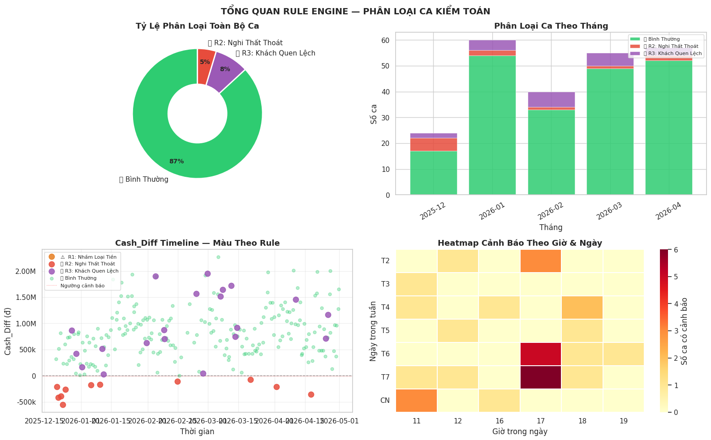

# 📄 BÁO CÁO KỸ THUẬT VÒNG 4: PRESCRIPTIVE (HỆ THỐNG LUẬT & BÁO CÁO)

Mục tiêu của Vòng 4 là tích hợp toàn bộ kết quả từ 3 vòng trước (Đối soát, Phân cụm, Khách quen) để xây dựng một **Hệ chuyên gia (Expert System)** đơn giản. Hệ thống này tự động phân loại nguyên nhân sai lệch, đánh giá mức độ nghiêm trọng và xuất báo cáo hành động cho từng ca làm việc.

---

## I. CƠ CHẾ HOẠT ĐỘNG CỦA RULE ENGINE (LOGIC KIỂM TOÁN)

Hệ thống áp dụng 3 quy tắc cốt lõi để "chẩn đoán" tình trạng của một ca trực dựa trên hai ngưỡng (threshold) cơ bản: `Lệch két < -5.000đ` và `Lệch bill > 5.000đ`.

### 1. Rule 1: Nhầm Loại Tiền (R1_Nham_Loai_Tien)

- **Logic:** `Cash_Diff` (Lệch két) mang giá trị âm **VÀ** `Payment_Mismatch` (Lệch bill) mang giá trị dương.
    
- **Giải thích:** Nhân viên bấm nhầm hình thức thanh toán trên máy POS (ví dụ: khách chuyển khoản nhưng bấm nhầm thành tiền mặt). Điều này làm máy tính hiểu rằng trong két phải có thêm tiền mặt, dẫn đến khi kiểm két thực tế bị hụt, nhưng tổng doanh thu cuối cùng vẫn đúng.
    

### 2. Rule 2: Nghi Thất Thoát Thực (R2_That_Thoat_Thuc)

- **Logic:** `Cash_Diff` mang giá trị âm **VÀ** `Payment_Mismatch` xấp xỉ bằng 0.
    
- **Giải thích:** Đây là trường hợp nguy hiểm. Máy tính và hóa đơn chi tiết khớp nhau hoàn toàn, nhưng tiền mặt thực tế trong két vẫn bị thiếu. Điều này chỉ ra tiền đã bị thất thoát sau khi đã ghi nhận hóa đơn (thối nhầm tiền hoặc lấy tiền túi).
    

### 3. Rule 3: Khách Quen Lệch (R3_Khach_Quen)

- **Logic:** Sử dụng kết quả từ **Vòng 3**. Nếu trong ca có bất kỳ đơn hàng nào của khách quen bị gắn cờ "Bất thường giá trị" hoặc "Bất thường thanh toán".
    
- **Giải thích:** Cảnh báo nhân viên có thể đang mượn tên khách quen để hợp thức hóa các đơn hàng sai lệch.
    

---

## II. GIẢI THÍCH CHI TIẾT BIỂU ĐỒ TỔNG QUAN (general-rule-engine.png)

Biểu đồ này là bảng điều khiển (Dashboard) trung tâm để quản lý rủi ro toàn hệ thống.

### 1. Biểu đồ Donut (Tỷ lệ phân loại toàn bộ ca)

- **Mục đích:** Cho cái nhìn tổng thể về "sức khỏe" tài chính của cửa hàng.
    
- **Ý nghĩa:** Chia các ca thành 4 trạng thái: **Bình thường (Xanh lá)**, **R1 (Vàng)**, **R2 (Đỏ)** và **R3 (Tím)**. Nếu màu Đỏ (R2) chiếm tỷ lệ cao, cửa hàng đang gặp vấn đề nghiêm trọng về thất thoát tiền mặt.
    

### 2. Biểu đồ Cột chồng (Phân loại ca theo tháng)

- **Mục đích:** Theo dõi xu hướng rủi ro theo thời gian.
    
- **Ý nghĩa:** Giúp quản lý nhận ra các giai đoạn cao điểm của sai lệch. Ví dụ: Nếu tháng 4 có số lượng cột đỏ (R2) cao vọt, cần xem xét lại đội ngũ nhân sự trực trong tháng đó.
    

### 3. Biểu đồ Timeline (Cash_Diff Timeline theo màu Rule)

- **Mục đích:** Định vị chính xác thời điểm xảy ra sai lệch nghiêm trọng.
    
- **Ý nghĩa:** Trục Y thể hiện số tiền lệch. Các chấm đỏ nằm sâu dưới trục 0 là các ca hụt két nặng nhất. Màu sắc của chấm giúp biết ngay ca đó bị lỗi thao tác (R1) hay nghi ngờ gian lận (R2).
    

### 4. Heatmap Cảnh báo (Theo giờ và ngày trong tuần)

- **Mục đích:** Tìm ra "khung giờ rủi ro".
    
- **Ý nghĩa:** Vùng màu đỏ đậm trên Heatmap chỉ ra các khoảng thời gian thường xuyên xảy ra sai lệch (ví dụ: tối Thứ 7 hoặc trưa Chủ Nhật). Đây thường là lúc quán đông khách, nhân viên áp lực cao dẫn đến dễ sai sót.
    

---

## III. GIẢI THÍCH CÁC BẢNG DỮ LIỆU ĐẦU RA

Hệ thống xuất ra các bảng dữ liệu có cấu trúc để phục vụ việc lưu trữ và tra cứu.

### 1. Bảng Thói Quen Khách Quen

|**Khách**|**Số đơn**|**ĐTB (đ)**|**% CK Thói quen**|**Phương thức chính**|
|---|---|---|---|---|
|Ngọc PT|31|46.516|0.0%|Tiền mặt|
|C Trang|15|240.533|92.2%|Chuyển khoản|

- **Giải thích:** Bảng này định nghĩa "Baseline" (mức chuẩn) cho mỗi khách. Nếu Ngọc PT (luôn trả tiền mặt) đột nhiên có đơn Chuyển khoản, Rule 3 sẽ kích hoạt.
    

### 2. Bảng Kết Quả Rule Engine (Dữ liệu Audit)

Bảng này chứa các cột quan trọng:

- **Severity (Mức độ):** `CAO` (Nếu vi phạm cả R2 và R3), `TRUNG BÌNH`, `THẤP`.
    
- **Detail Lines:** Chứa nội dung giải thích chi tiết lý do bị cảnh báo (ví dụ: "Két hụt 50k, đối soát bill khớp -> Nghi thất thoát").
    

---

## IV. HÀNH ĐỘNG ĐỀ XUẤT (ACTIONABLE INSIGHTS)

Dựa trên báo cáo tự động, quản lý có thể thực hiện các hành động sau:

1. **Với ca Severity CAO:** Kiểm tra lại camera ngay lập tức tại các mốc thời gian ghi trong báo cáo.
    
2. **Với ca vi phạm R1:** Nhắc nhở nhân viên tập trung hơn khi bấm chọn phương thức thanh toán trên máy POS.
    
3. **Với ca vi phạm R2:** Yêu cầu nhân viên giải trình về số tiền hụt thực tế khi két và máy tính không khớp.
    

> **Kết luận:** Vòng 4 đã chuyển đổi các con số khô khan thành những **báo cáo có tính định hướng**, giúp giảm thời gian đối soát thủ công từ vài tiếng xuống còn vài phút, đồng thời tăng tính minh bạch trong quản lý dòng tiền.